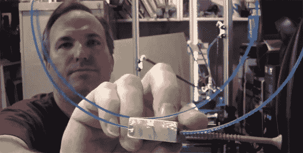

# 甲板螺旋挤压机

> 原文：<https://hackaday.com/2013/08/17/a-deck-screw-extruder/>

很多伟大的想法都是在午夜产生的，对[沃纳]来说也不例外。一天晚上，他想出了一个新的 3D 打印机挤压机的想法，在一个非常基本的原型之后，我们不得不说他可能有所发现。它基本上是一个甲板螺丝作为蜗轮来驱动灯丝，但这个简单的想法有很多很酷的优点。

这种挤压机有两个非常有趣的特点，如果[Werner]决定将他的想法具体化为一个真正的原型。首先，这种挤出机的步进电机可以非常小，并直接安装在挤出机上方。这为轻松制造能够处理多根细丝的多挤压打印机打开了大门。其次，使用甲板螺钉作为蜗轮意味着在塑料细丝和驱动齿轮之间有巨大的接触面积。

尽管通常的挤出机装置仅沿着滚花螺栓的一个或两个花键与塑料细丝接触，但是[Werner]的设计沿着甲板螺杆蜗轮的整个长度驱动细丝。这可以很容易地转化为更精确的挤压，而不用像今天的挤压机那样摆弄弹簧和螺栓。

在任何情况下，这都是一个非常有趣的想法，我们希望看到[Werner]或其他人用这种设计制造出一台功能性挤出机。