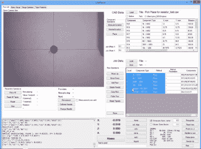

# 你现在就可以自己动手制作

> 原文：<https://hackaday.com/2015/02/06/a-diy-pick-and-place-you-can-build-right-now/>

最近出现了相当多的 DIY 拾放项目，但大多数仅限于概念设计或部分工作原型。[Juha]写信让我们了解他的项目 LitePlacer，这是一个功能齐全的 DIY 拾取和放置机器，具有工作视觉，可以实际导入 BOM 并以相当高的精度放置小至 0402 的零件。

虽然我们介绍的一些其他 DIY 拾取和放置设置使用了相当奇特的设置[如 delta 机器人](http://hackaday.com/2014/10/02/thp-hacker-bio-neil-jansen/)，但这台机器是围绕典型的凹槽轴承和挤压铝制造的。末端执行器包括旋转真空尖端和安装在尖端旁边的摄像机。照相机为定位基准点和寻找零件的位置提供反馈。[Juha]没有为他的机器使用进料器，而是选择直接从切割好的胶带上挑选零件。如果你要放置大量的单个零件，这可能会不方便，但有助于保持设计简单。

运行这台机器的软件相当复杂。经过一点配置后，它能够导入一个带有 X/Y 信息的 BOM，并在几秒钟内开始放置。它还使用相机校准指针，使用基准点测量 PCB，并精确定位切割胶带部分的位置。

如果你想建造自己的机器，[Juha]发布了[详细说明](http://www.liteplacer.com/the-machine/assembly-instructions/)，引导你完成整个组装过程。如果你不想自己采购所有东西，他还出售一套[零件](http://liteplacer.com/opencart/index.php?route=product/product&product_id=50)。休息后查看视频，查看机器导入 BOM 并放置一些零件(一直到 0402)。

[https://www.youtube.com/embed/0bYrwi3UA_A?version=3&rel=1&showsearch=0&showinfo=1&iv_load_policy=1&fs=1&hl=en-US&autohide=2&wmode=transparent](https://www.youtube.com/embed/0bYrwi3UA_A?version=3&rel=1&showsearch=0&showinfo=1&iv_load_policy=1&fs=1&hl=en-US&autohide=2&wmode=transparent)