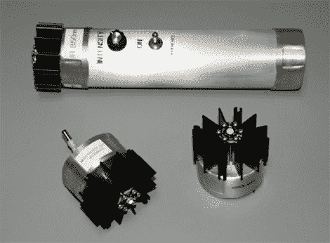

# 适合任何场合的手电筒

> 原文：<https://hackaday.com/2012/04/27/a-flashlight-for-any-occasion/>

无论你是想照亮自己的路，打造自己的夜视能力，还是在家做日光浴，这款手电筒都能帮你搞定。【David Prutchi】设计了[高功率手电筒，有三个可更换的头](http://www.prutchi.com/2012/04/27/d-i-y-high-power-swappable-head-uvirvisible-led-flashlight-with-intensity-control)。

他用铝管建造了基本单元。它有足够的空间容纳四节 9V 电池作为电源。驱动电路只是比其中一个电池小一点点，为了把整个东西放在一起[David]和他的助手添加了一个电位计，拨动开关和快速连接器，使头部交换变得轻而易举。这些头本身都是基于 LED 的，一个用于可见光，另一个用于红外线，最后一个模块输出紫外线。我们开玩笑说用它来晒黑皮肤，但是在 10 瓦的功率下，你应该更担心对你视力的意外伤害。

成品显示检查一些加拿大货币上的安全墨水。这也将为你的夜视单片眼镜提供一个很好的辅助光源。