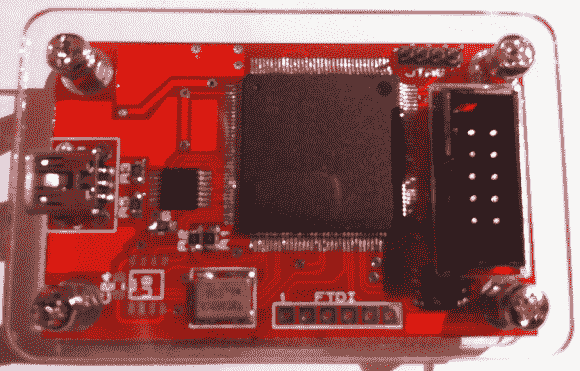

# 一种基于 FPGA 的总线盗版克隆

> 原文：<https://hackaday.com/2014/03/10/a-fpga-based-bus-pirate-clone/>

嵌入式开发的一个必要工具是能够使用通用协议(如 UART、SPI 和 I2C)的设备。XC6BP 是一款开源设备，可以支持多种协议。

顾名思义，XC6BP 是[总线盗版](http://dangerousprototypes.com/docs/Bus_Pirate)的克隆，但基于 Xilinx Spartan-6 FPGA。在 FPGA 上加载了 [AltOR32](http://opencores.org/project,altor32) 软 CPU。这是一款基于 [OpenRISC](http://en.wikipedia.org/wiki/OpenRISC) 架构的全功能处理器。虽然 FPGA 比微控制器更贵，但它可以完全重新编程。也可以在 FPGA 上构建硬件来执行各种任务。

一个简单的 USB 堆栈在软 CPU 上运行，创建一个虚拟的 COM 端口。结合 USB 收发器，它提供与主机的通信。该设备甚至与总线盗版外壳和探针连接器兼容。虽然它不会取代作为低成本工具的 Bus Pirate，但看到有人使用开源核心来构建有用的开放硬件设备还是很不错的。