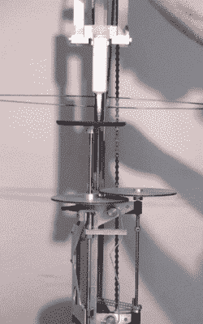

# 一台全机械 3D 打印机令人兴奋不已

> 原文：<https://hackaday.com/2014/07/13/a-fully-mechanical-3d-printer-is-mind-blowing/>

像这样的项目给我们留下深刻印象已经有一段时间了。乌特勒支艺术学院的学生 danil de Bruin 刚刚对他的机械 3D 打印机进行了最后的润色。

没错。**机械。**

没有电脑，没有马达，只有重力。它可能是 100 年前建造的。

这台机器使用 15 公斤的重量为机械装置提供动力——在打印过程中确实需要重置，但对于这种机械自动化来说，这是一个很小的代价。

他在糊料挤压机中使用一种粘土，慢慢地将材料沉积在构建平台上。为了给机器编程，有一个小的导向机构，它沿着弯曲的铝线的轮廓运动。这允许你制作任意数量的对称和圆形物体。

[danil]说他受启发建造了这台机器，因为他热爱 3D 打印——但同时，他觉得这有点像作弊。除了按下打印按钮，没有真正的人类互动。

> 我热爱技术，但我如何才能收回我作品的所有权？也许是通过制造生产工作的机器。也许是通过给我建造的机器提供能量，来产生工作。为了重新找回创造的感觉，我创造了。

[https://player.vimeo.com/video/98488940](https://player.vimeo.com/video/98488940)

惊人的工作[丹尼尔]！