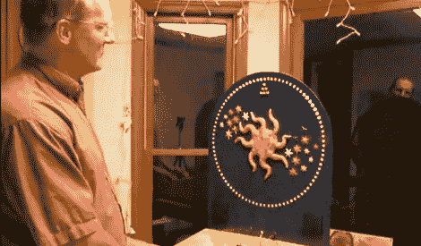

# 北卡罗莱纳州制造者集会的技巧游戏

> 原文：<https://hackaday.com/2012/06/18/a-game-of-skill-for-the-north-carolina-maker-faire/>

北卡罗来纳制造商的票价是上周末，在庆祝活动的过程中，[戴夫]被要求提供他制作的街机游戏的文档。这是一个整洁的建筑，所以我们很高兴他选择与我们分享它。

任何在过去 15 年里去过街机的人都看过[戴夫]受到启发的游戏。游戏的目标是当顺序点亮的灯处于特定位置时点击按钮。[Dave]用 90 个 led 和一个非常小的[FPGA 开发板](http://www.xess.com/prods/prod048.php)构建了他自己的版本。

90 个 led 由 FPGA 使用 charlieplexing 控制，在游戏开始时依次点亮。一个重型紧急开关按钮被改造成一个瞬时按钮，每当玩家认为 LED 将落在“头奖区”时，它就会被击中如果玩家赢了，蜂鸣器响起，所有人都非常兴奋。

鉴于这款游戏的街机版完全是骗人的，不可能赢，我们真的很喜欢[戴夫]的版本。休息之后你可以看看他的演示视频。

[https://www.youtube.com/embed/w0gGeJx_YCM?version=3&rel=1&showsearch=0&showinfo=1&iv_load_policy=1&fs=1&hl=en-US&autohide=2&wmode=transparent](https://www.youtube.com/embed/w0gGeJx_YCM?version=3&rel=1&showsearch=0&showinfo=1&iv_load_policy=1&fs=1&hl=en-US&autohide=2&wmode=transparent)