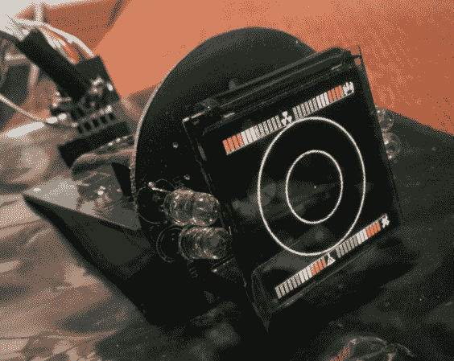

# 越野启示录车的盖革计数器

> 原文：<https://hackaday.com/2014/08/24/a-geiger-counter-for-an-off-road-apocalypse-vehicle/>

如果世界末日来了，有所准备是好事。假设世界末日是由一系列核爆炸引发的。如果是这样的话，那么有一个盖革计数器是必须的，再加上有一个好的交通工具也会有所帮助。所以[Kristian]结合了这两个想法，创造了他自己的汽车用盖革计数器,只是为了万一有一天他可能需要它。

这一切都是从一个一起制作的自制柜台开始的。然后是一个内置图形控制器的显示模块，用于显示车辆中的各种信息。这是利用几个光耦合器作为输入来实现的。此外，还安装了一个 CAN 总线接口。正如早期的一篇文章所指出的，显示电路是基于微芯片 18F4680 微控制器。在那之后，事情变得有点失控，柜台演变成一个移动通信中心；主要是因为[克里斯蒂安]想了解这些系统是如何工作的。听起来是一次有趣的学习经历！后来，CPU 和压力计被重新设计以使用低静态调节器。还制作了一个过滤板，如果需要，可以消除瞬变和噪声。

完整的项目可以在[【克里斯蒂安】的博客](http://glowingcircuits.wordpress.com/)上看到。