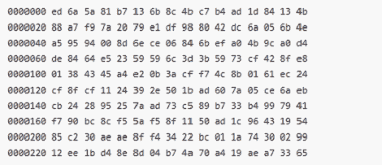

# 适用于 FPGA 的硬件随机数发生器

> 原文：<https://hackaday.com/2012/07/18/a-hardware-random-number-generator-for-your-fpga/>

[Zach]提交了一个他一直在做的项目，该项目将硬件随机数发生器带到了你可能到处都有的普通硬件上。它被称为 Whirlyfly，它将 FPGA 开发板变成一个硬件随机数，能够通过 USB 连接以 3 Mbps 的速度输出随机位。

以前，[whirlygig 在一个定制的 CPLD](http://hackaday.com/2010/02/06/hardware-based-randomness-for-linux/) 上运行，该 CPLD 与一个*nix 盒接口，并通过/dev/hw_random 提供高质量的随机数。[Zach]努力将 whirlygig 的核心移植到非常受欢迎且廉价的 [Papilio One](http://www.papilio.cc/) FPGA 开发板上。

至于[扎克]可以用他的随机数发生器做什么，写一个[蒙特卡罗实验](http://en.wikipedia.org/wiki/Monte_Carlo_method)来近似π的值是非常容易的，比[托勒密]在 1900 年前能够达到的精度更好。还有加密方面，为什么你会这样做，我们不知道，制作一个不可压缩的文件也是可能的。