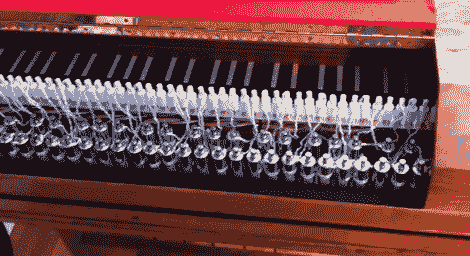

# 自动演奏的大键琴

> 原文：<https://hackaday.com/2012/10/19/a-harpsichord-that-plays-itself/>

马尔科姆·梅西特是一名双簧管演奏家，他喜欢演奏巴洛克时期的作品。这通常意味着弹奏一把大键琴，他设法弄到了一把属于自己的大键琴。不幸的是，你不能同时演奏这两种乐器，所以他开始让键盘自动化。你在这里看到的是一个完全工作的版本，但他很快就继续增加螺线管以及上层。他的故事始于本刊第 27 页 (PDF)。

他真的不怕麻烦，确保仪器没有被滥用。一位橱柜制造商制作了一些支架来将系统安装在按键上方。一个朋友在一块丙烯酸板上钻孔并敲击，每个螺线管都安装在上面。每个螺线管轴都垫有毛毡，以缓冲对按键的冲击。休息之后，我们嵌入了两个演示视频，展示了第一个和第二个版本的构建。

大键琴拨动琴弦，而不是像钢琴那样用锤子敲击。许多琴键的拔毛机制已经磨损，所以[Malcolm] [使用 3D 打印机来帮助更换它们](http://www.makerbot.com/blog/2012/08/02/bringing-back-the-music-with-a-makerbot/)。

[https://www.youtube.com/embed/koUTb5rUDaI?version=3&rel=1&showsearch=0&showinfo=1&iv_load_policy=1&fs=1&hl=en-US&autohide=2&wmode=transparent](https://www.youtube.com/embed/koUTb5rUDaI?version=3&rel=1&showsearch=0&showinfo=1&iv_load_policy=1&fs=1&hl=en-US&autohide=2&wmode=transparent)

[https://www.youtube.com/embed/UbwfAc0AKhk?version=3&rel=1&showsearch=0&showinfo=1&iv_load_policy=1&fs=1&hl=en-US&autohide=2&wmode=transparent](https://www.youtube.com/embed/UbwfAc0AKhk?version=3&rel=1&showsearch=0&showinfo=1&iv_load_policy=1&fs=1&hl=en-US&autohide=2&wmode=transparent)

[谢谢 Chetchez]