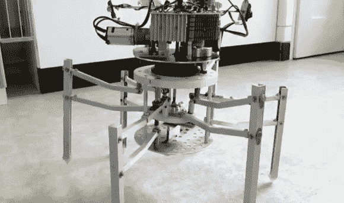

# 由废料制成的六足机器人

> 原文：<https://hackaday.com/2012/12/14/a-hexapod-robot-made-from-scrap/>

许多好的黑客来自废料或未使用的零件，但这个六足机器人将它带到了一个新的水平。[Helmut]写信给[告诉我们他用废弃电子产品建造的“机器人](http://www.youtube.com/watch?v=lNZohu0-QhY&feature=youtu.be "Radial robot - English")。与我们在这里介绍的大多数小型步行机一样，这个机器人的特点是在头部安装了一个传感器阵列，可以进行一些基本的避障。

头部控制这个机器人的方式是这个装置真正有趣的地方。头部不是发送信号告诉伺服电机以特定的步态行走，而是向它应该去的方向倾斜。虽然有点难以分辨，但似乎是头部组件中的驱动电机将一种凸轮轴向下推入体内。然后，这是机械耦合到腿，使它走在正确的方向。

休息之后，一定要看看视频，有英语的电脑解说，或者是德语的真人解说。

[https://www.youtube.com/embed/lNZohu0-QhY?version=3&rel=0&showsearch=0&showinfo=1&iv_load_policy=1&fs=1&hl=en-US&autohide=2&wmode=transparent](https://www.youtube.com/embed/lNZohu0-QhY?version=3&rel=0&showsearch=0&showinfo=1&iv_load_policy=1&fs=1&hl=en-US&autohide=2&wmode=transparent) [https://www.youtube.com/embed/3yOy7mXl3r8?version=3&rel=0&showsearch=0&showinfo=1&iv_load_policy=1&fs=1&hl=en-US&autohide=2&wmode=transparent](https://www.youtube.com/embed/3yOy7mXl3r8?version=3&rel=0&showsearch=0&showinfo=1&iv_load_policy=1&fs=1&hl=en-US&autohide=2&wmode=transparent)