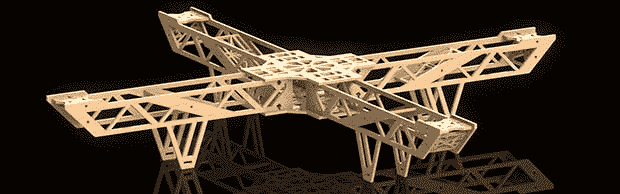

# 一个巨大的轻型木制四旋翼飞行器

> 原文：<https://hackaday.com/2014/05/27/a-huge-lightweight-wooden-quadrotor/>

[罗伯特]曾经通过锯层压地砖建造了一个四轴飞行器框架。它起作用了，我们把这个建筑缺乏照片作为它有多丑的证据。[他的最新设计](http://armageddon421.de/?p=319)使用了一种更好看的材料——激光切割胶合板——成品非常坚固和轻便，即使与用玻璃或碳纤维和环氧树脂制成的商业框架相比也是如此。

虽然由于 Solidworks 的一些技能，设计进行得很顺利，但实际上从 3 毫米桦木板切割框架会导致一些问题。用于切割的廉价激光切割机包括一些名为 LaserWorksV5 的底层软件。有一个切缝补偿功能，在该软件的原生中式英语中称为“缝纫补偿”。每当试图计算圆的补偿时，软件总是会崩溃。[Robert]花了两个小时来解决这个问题，最后需要展开一张砂纸来获得良好的互锁配合。

完成的框架完全不用任何胶水就可以连接在一起，最棒的是它的重量——只有 167 克。相比之下，类似大小的玻璃纤维框架，和[罗伯特]的剃了至少 200 克了他的成品。