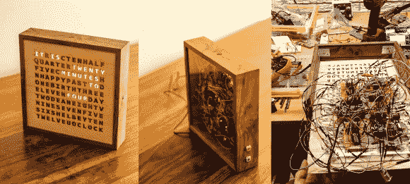

# 激光切割字钟

> 原文：<https://hackaday.com/2014/07/19/a-laser-cut-word-clock/>

什么是字钟？单词时钟是一种印刷显示时间的时钟，也是一种互动艺术。与其花 1500 美元买一个，[buckeeyguy 89]决定[造一个作为给他哥哥的礼物](http://imgur.com/a/iMXmj?gallery)。确实是一件非常好的礼物！

在设计一个单词时钟时，有许多不同的因素在起作用。前面板由激光切割的桦木制成，使用的是 [Ponoko](https://www.ponoko.com/) 的服务。此外，需要白色半透明的丙烯酸片来防止每个单词的光线渗入相邻的字母。硬件使用两个 Arduinos 来控制 led 和一个 DS3231 RTC 来保持准确的时间。结果非常令人印象深刻，但如果在最终版本中使用定制 PCB，组装肯定会更容易。对于一个一次性的项目，这是一个伟大的生日礼物。

这个字钟的工艺非常棒，非常适合任何家庭。你做过哪些不仅仅涉及电子产品的项目？有时候，质量美学会带来很大的不同。