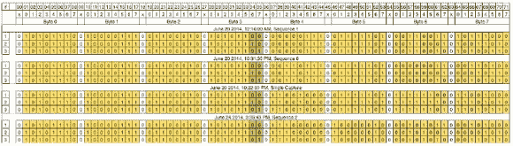

# 盲逆向工程的一课——信号智能

> 原文：<https://hackaday.com/2014/07/24/a-lesson-in-blind-reverse-engineering-signals-intelligence/>

> 在一阵绝望中，我求助于数据挖掘工具和算法，但在我的头脑崩溃之前，我从那种无法形容的知识的恐惧中退了回来。疯狂就在于此。
> 
> –[罗里·奥黑尔]

睿智的话语。确实是明智之言。我们当中有谁没有盯着看似无穷无尽的数据的深渊，却丝毫不知道它意味着什么，甚至不知道如何去弄清楚它意味着什么？当你开始看到“1”和“0”从每天的电子设备中向你伸出手时，就能真切地感受到大脑的损伤……就像电线中的幽灵。但是不要害怕，聪明的黑客！因为我们有好消息要报告！[罗里·奥黑尔]已经跳入这个深渊，并取得了成功。

当其他人都出去玩游戏，做任何非黑客做的事情来娱乐自己时，[Rory O'hare]决定伸出手来，抓住一些随机的无线信号，寻找一点乐趣和刺激。他发现的不仅仅是 433 兆赫的强重复信号。不仅仅是一个充满 ASK 证据的信号。他所发现的是一个挑战…一个亟待解决的谜团。一种测试他技能的方法。他能仅仅通过观察信号来逆向工程信号吗？继续读下去，[找出](https://github.com/r-ohare/Amateur-SIGINT)。