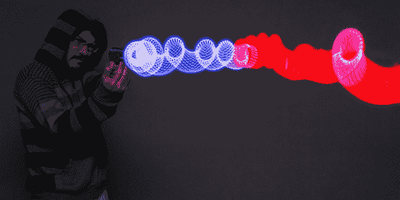

# 一种光绘红外线枪

> 原文：<https://hackaday.com/2014/04/19/a-light-painting-infrared-ray-gun/>

[注]Adafruit[的产品非常棒](https://learn.adafruit.com/diy-flir-light-painting-heat-map-photography),结合了互联网对闪光发光二极管和激光枪的喜爱以及昂贵的热成像相机背后的令人敬畏的技术。这是一个光绘红外热风枪，用于拍摄长时间曝光的照片，并根据物体的温度将场景“绘”成红色或蓝色。

虽然这不是一个合适的前视红外相机，但有一个 DSLR 和一个大开的快门，可以通过简单地用光枪“画”一个场景来拍摄伪热图像。这是一个荒谬的聪明技术[我们在](http://hackaday.com/2013/01/03/an-absurdly-clever-thermal-imaging-camera/)之前见过，如果你正在寻找窗户周围的漏洞，或者只是想要一个有用的角色扮演道具，它有可能成为一个有用的工具。

这种射线枪内部的电路基于连接到 Adafruit Gemma 的非接触式红外传感器，led 由 NeoPixel 环提供。有两种 3D 可打印外壳——传统的激光枪/爆能枪和更实用的魔杖外壳。无论使用哪种外壳，都有可能拍摄一些漂亮的热图图片，如下图所示。

[https://www.youtube.com/embed/G_NQNFUaHRQ?version=3&rel=1&showsearch=0&showinfo=1&iv_load_policy=1&fs=1&hl=en-US&autohide=2&wmode=transparent](https://www.youtube.com/embed/G_NQNFUaHRQ?version=3&rel=1&showsearch=0&showinfo=1&iv_load_policy=1&fs=1&hl=en-US&autohide=2&wmode=transparent)