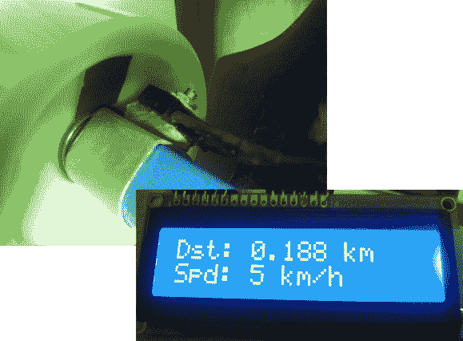

# 长板速度和距离计算机

> 原文：<https://hackaday.com/2013/03/04/a-longboard-speed-and-distance-computer/>

为什么骑自行车的人应该拥有所有的花哨玩具？如今，自行车电脑非常普遍，但你不会发现滑板和长板有类似的硬件。[KobraX22]并没有就此罢休。他为他的长板制造了这台速度和距离计算机。它不使用很多组件，应该很容易安装。

该设备通过在其中一辆卡车上安装反射传感器来监控其中一个车轮的旋转。它指向一个轮子的内部，轮子上有一条黑色的胶带。每次胶带通过时，它都会阻止红外 led 在其配对的接收器处反射回来。这使得 Arduino 可以计算转数，然后与车轮直径配对，以计算速度和行驶距离。当然，车轮会随着时间的推移而磨损，所以经常骑车的人必须定期进行新的测量。

[KobraX22]配有 QRB1114 传感器。它的成本不到 2 美元，而且不需要像霍尔效应传感器那样在方向盘上嵌入磁铁。它也不应该干扰你所做的任何其他花哨的滚轮设计，比如[添加视点显示](http://hackaday.com/2012/11/16/pov-wheels-for-a-longboard/)。

[via [Reddit](http://www.reddit.com/r/arduino/comments/19k33l/some_pictures_of_my_longboard_speedometer_project/)