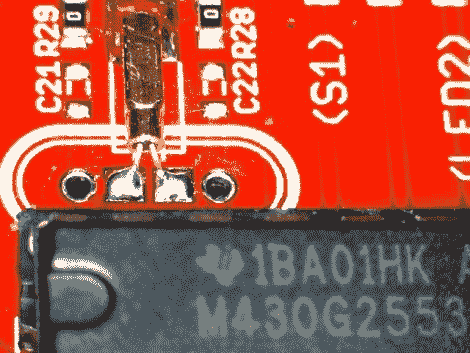

# 了解 TI Launchpad 附带的升级版 MSP430 芯片

> 原文：<https://hackaday.com/2012/07/31/a-look-at-the-upgraded-msp430-chip-shipping-with-the-ti-launchpad/>

【JMN】花了一些时间[看 MSP430G2553 微控制器](http://webdelcire.com/wordpress/archives/2068) ( [翻译](http://translate.google.com/translate?sl=auto&tl=en&js=n&prev=_t&hl=en&ie=UTF-8&layout=2&eotf=1&u=http%3A%2F%2Fwebdelcire.com%2Fwordpress%2Farchives%2F2068))。具体来说，他对时钟选项和低功耗模式感兴趣。该芯片是[与 TI Launchpad](http://www.43oh.com/2011/12/confirmed-ti-shipping-launchpads-with-msp430g2553-and-msp430g2452/) 一起发货的升级处理器之一。

MSP430G2553 和 MSP430G2452 都带有 Launchpad 开发板。它们取代了最初提供的 MSP430G2231 和 MSP430G2211。如果你已经有了一个 Launchpad，芯片本身只需 2.25 美元左右，而且很容易编程，因为开发硬件没有改变。

审查从查看处理器的时钟选项开始。首先对内部 VLO 进行测试，通过使用吹风机查看功耗，然后是温度稳定性。提供的实际频率准确度相当低，但是当受到热空气冲击时，它保持相当稳定。下一个测试使用提供的 32.768 kHz 时钟晶体作为外部输入。晶体与 Launchpad 板一起提供，芯片具有可配置的内部电容，因此这就像将封装焊接到位一样容易。点击顶部的链接，了解该时钟源在测试中的表现。

[谢谢 D]