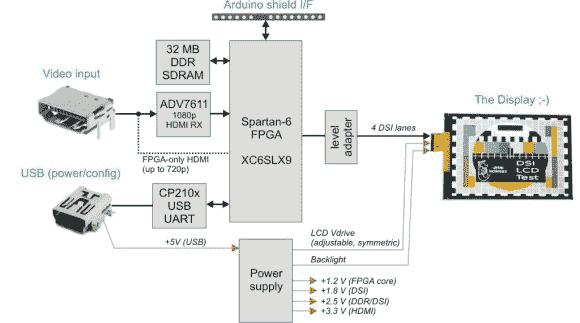

# MIPI DSI 显示器屏蔽/HDMI 适配器

> 原文：<https://hackaday.com/2014/08/19/a-mipi-dsi-display-shieldhdmi-adapter/>

[Tomasz]向我们透露了他在 hackaday . io 上安装的有据可查的 [MIPI DSI Display Shield / HDMI 适配器。](https://hackaday.io/project/364)[显示器串行接口](http://en.wikipedia.org/wiki/Display_Serial_Interface) (DSI)是一种基于数据包的高速接口，用于向最新的 LCD/有机发光二极管显示器传输视频数据。它使用几个差分数据通道，其频率可能达到 1 GHz，具体取决于所需的分辨率和帧速率。

因此，上图中解释的主板允许任何 HDMI 内容在您可能放在身边的支持 DSI 的 scrap 显示器上播放。它包括一个 32MB 的 DDR 内存，作为帧缓冲，所以你的“慢”Arduino 平台可能有足够的时间上传你想要显示的图片。

CP2103 进行 USB 到 UART 的转换，允许您的计算机配置显示适配器的内部设置。该平台基于 XC6SLX9 Spartan-6 FPGA，所有源代码可以从[官方 GitHub 存储库](https://github.com/twlostow/dsi-shield)下载，以及原理图和 gerbers。休息之后，我们嵌入了一个演示视频，其中一个 Raspi 驱动一个 iPhone 4 LCD。

[https://www.youtube.com/embed/vCWGMM00ZEk?version=3&rel=1&showsearch=0&showinfo=1&iv_load_policy=1&fs=1&hl=en-US&autohide=2&wmode=transparent](https://www.youtube.com/embed/vCWGMM00ZEk?version=3&rel=1&showsearch=0&showinfo=1&iv_load_policy=1&fs=1&hl=en-US&autohide=2&wmode=transparent)