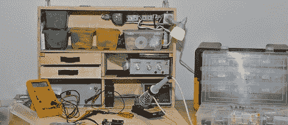

# 适合您所有项目的移动电子实验室

> 原文：<https://hackaday.com/2012/10/07/a-mobile-electronics-lab-for-all-your-projects/>

当[尼斯克尔]的儿子得到一个非常非常吵的玩具时，他做了任何一个好的制造商父母都会做的事情:他没有拆除电池，而是寻求一种降低音量的方法。这当然意味着打开玩具，用烙铁敲打电路板。没有固定的电子工作台意味着[Nisker]需要从装满工具的包里翻出他的 Weller。在狭小的工作空间里做一个修补者肯定有更简单的方法。

[Nisker]的解决方案是建立一个移动电子工作台。由此产生的木箱有足够的空间来容纳信号发生器、电源、烙铁、万用表和一堆制作或修改电子项目所需的其他工具。

这个箱子是在 Google Sketchup 中设计的，侧面用 12 毫米厚的胶合板，架子用 6 毫米厚的胶合板。所有的碎片都是用圆锯切割出来，用螺丝和胶水拼在一起的。

现在[Nisker]有了一个非常紧凑的 16.9 x 7.9 x 22 英寸的电子实验室，他可以携带到任何地方。如果你受到目前空间的限制，这是一个不错的项目，一旦你最终建立了一个合适的工作室，它也足够优雅。