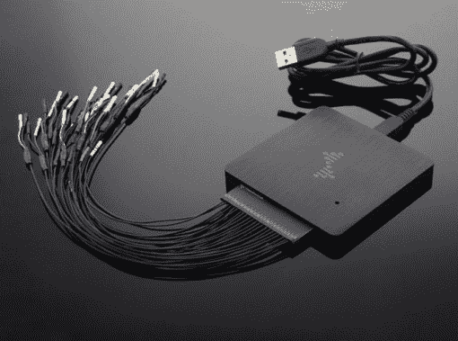
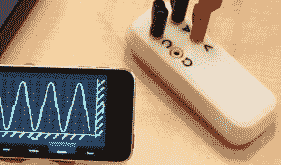
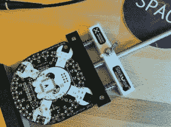
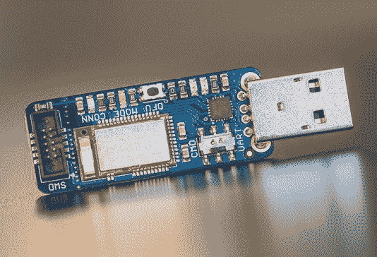
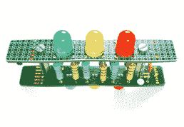
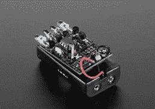

# 使用这些部件的项目会获得大量奖励

> 原文：<https://hackaday.com/2015/06/08/a-mountain-of-prizes-for-projects-using-these-parts/>

这是你从[hack aday 奖](http://hackaday.io/prize)中带些好东西回家的机会。在接下来的 3 周里，我们将使用 Atmel、Freescale、Microchip 和德州仪器的零件寻找最佳条目。

四个竞赛(是的，四个同时进行)中的每一个都将授予前 50 名的项目。总共有 200 个被认可。胜算真的对你有利——目前有些列表上只有不到 50 个项目——所以马上加入你的列表吧！向下滚动，查看我们为这次史诗般的跑步活动提供的堆积如山的奖品。

## 确保我们知道你的进入

有两件事你需要做，才有资格获得这一堆令人敬畏的东西:

1.  [请将您的项目](http://hackaday.io/had2015)输入 2015 年黑客日大奖
2.  [在此留下评论](https://hackaday.io/page/1019-are-you-using-these-parts-tell-us-to-put-you-on-the-list)并附上您项目的链接，我们会将其添加到列表中

**在 6 月 29 日星期一早上之前做这件事**,以确保你正在跑步。我们一直在努力向列表中添加 [Atmel](https://hackaday.io/list/5847-2015-thp-atmel-parts) 、 [Freescale](https://hackaday.io/list/5845-2015-thp-freescale-parts) 、 [Microchip](https://hackaday.io/list/5846-2015-thp-microchip-parts) 和[德州仪器](https://hackaday.io/list/5844-2015-thp-texas-instruments-parts)的条目，但以新条目不断出现的速度，很容易在这里或那里漏掉一个。不要羞于要求加入这些名单！

前提条件是使用这四家制造商之一的零件。我们会看看这些列表，看看哪些项目使用了伟大的想法，这些想法也有很好的记录。告诉我们你为什么要建造它，它有什么作用，你是怎么想出这个主意的…你知道，整个故事！

## 战利品

  DS Logic  Mooshimeter  Stickvise

四场比赛中的每一场都有以下内容可供选择:

3x [Mooshimeters](http://store.hackaday.com/collections/products-tools/products/mooshimeter-1-0) 是一种万用表，它将您的智能手机用作无线读数。

2x [DS 逻辑](http://store.hackaday.com/collections/products-tools/products/dslogic)分析仪，其中【亚当】[回顾了几周前](http://hackaday.com/2015/05/26/review-dslogic-logic-analyzer/)。

15x [Stickvise](http://store.hackaday.com/products/stickvise) 在您工作时固定您的 PCB(和其他东西)

  Bluefruit LE Sniffer  Cordwood Puzzle  TV-B-Gone

这是我们在 4 场比赛中送出的礼物的延续:

10x [Bluefruit LE 嗅探器](http://store.hackaday.com/products/bluefruit-le-sniffer-bluetooth-low-energy-ble-4-0-nrf51822-v1-0)帮助您找出您的 BTLE 设备正在传输什么

10x [积木拼图](http://store.hackaday.com/products/cordwood-puzzle-first-edition)；拿起你的熨斗，解决这个令人挠头的焊接挑战

10x [TV-B-Gone](http://store.hackaday.com/products/hackaday-tv-b-gone-kit) 是【米奇·奥特曼】的标志性发明；一键关闭所有电视

* * *

#### 2015 年[黑客日奖](http://hackaday.io/prize)由以下机构赞助:

