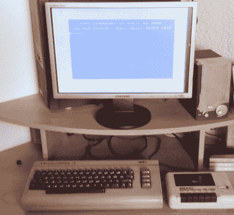

# 怀旧地看看一个 13 岁的孩子能用 C64 做什么

> 原文：<https://hackaday.com/2012/11/13/a-nostalgic-look-at-what-a-13-year-old-can-do-with-a-c64/>

[阿明]最近拿出他的 Commodore 64，回顾他小时候做的项目。令人惊讶的是，我们谈论的并不像你想象的那么久远。2002 年他 13 岁，家里没有电脑。但是十多年前，他的父亲买了一台 C64，阿明开始钻研手册，自学编程。本周，他将旧硬件连接到他的视频采集卡上，向我们展示了他的成果。

他在当地的计算机俱乐部见过 Windows 95，他想为什么不为手头的机器设计一个该软件的克隆版呢？他称之为 Windows 105(因为这个数字高于 95)，并想出了模仿 DOS、Corel Draw、Notepad 等程序以及微软 Office 中的一些程序的方法。他们没有包括真实事物的所有功能，但是看起来在那里。

这个故事确实有一个快乐的结局。(阿明的)父母看到了他在做什么，并设法拿起一台电脑让他玩。现在，他是一名职业程序员，回顾了他成长的岁月。休息之后，我们嵌入了他的一个演示视频，供您欣赏。

[https://www.youtube.com/embed/2HOkOBX97FU?version=3&rel=1&showsearch=0&showinfo=1&iv_load_policy=1&fs=1&hl=en-US&autohide=2&wmode=transparent](https://www.youtube.com/embed/2HOkOBX97FU?version=3&rel=1&showsearch=0&showinfo=1&iv_load_policy=1&fs=1&hl=en-US&autohide=2&wmode=transparent)