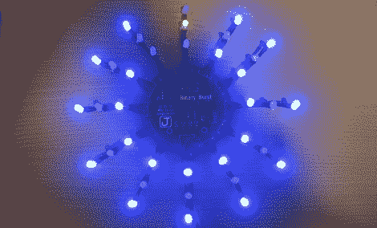

# 来自 Hackaday 自己的新颖二进制时钟

> 原文：<https://hackaday.com/2012/04/29/a-novel-binary-clock-from-hackadays-own/>

Hackaday 自己的[Mike Szczys]刚刚分享了一个他正在制作的[超棒的二进制时钟](http://jumptuck.com/2012/04/28/binary-burst-clock-demonstration/)。不像普通的二进制时钟，只有自认的极客和书呆子才看得懂，[迈克]的时钟几乎可以被普通大众理解。

[Mike]的时钟表面有 12 排三个发光二极管。这些 LED 以二进制表示时间，以分钟为单位，内部 LED 为 1，中间 LED 为 2，外部 LED 为 4。将钟面周围的每个发光二极管相加，得出自整点以来经过的分钟数。

为了显示小时，[Mike]在每一行发光二极管的中间使用了红/蓝双色发光二极管。例如，在 1:03 时，一点钟指针将在第一位置具有蓝色 LED，在第二位置具有紫色 LED。一分钟后，在 1:04，这变成蓝色，红色，蓝色。

如果这有点令人困惑，有一个[精彩的视频](http://www.youtube.com/watch?feature=player_embedded&v=ItUmJYx2YAc#!)展示了 led 在一小时内的模式。

对于这样一个有趣的时钟，构建相当简单——只是一个带有 STP16CP05 LED 驱动器的 ATtiny44。时间由电池供电的 MCP7940 实时时钟保持，电源由简单的 USB 端口提供。

[Mike]有足够的电路板来制造几十个时钟，但只有足够的零件(和耐心)来焊接四个时钟。休息之后，你可以在其中一块板上查看他带着烙铁进城的时间。和所有好的构建一样，如果你想自己做，代码和图表会在 GitHub 上[提供。](https://github.com/szczys/Binary-Burst-Clock)

[https://www.youtube.com/embed/ItUmJYx2YAc?version=3&rel=1&showsearch=0&showinfo=1&iv_load_policy=1&fs=1&hl=en-US&autohide=2&wmode=transparent](https://www.youtube.com/embed/ItUmJYx2YAc?version=3&rel=1&showsearch=0&showinfo=1&iv_load_policy=1&fs=1&hl=en-US&autohide=2&wmode=transparent) [https://www.youtube.com/embed/v9x7FkXW6Mo?version=3&rel=1&showsearch=0&showinfo=1&iv_load_policy=1&fs=1&hl=en-US&autohide=2&wmode=transparent](https://www.youtube.com/embed/v9x7FkXW6Mo?version=3&rel=1&showsearch=0&showinfo=1&iv_load_policy=1&fs=1&hl=en-US&autohide=2&wmode=transparent)