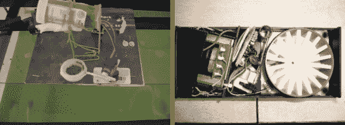

# 一对自动喂鱼器

> 原文：<https://hackaday.com/2013/02/08/a-pair-of-automatic-fish-feeders/>

有时黑客话题会一波一波地出现。例如，我们得到消息，这对自动喂鱼机相距仅一小时。也许是一年中的这个时候，人们即将去度假，并希望确保他们的海洋宠物不会挨饿？

左边的馈线是一个真正的黑客。它由一对伺服系统和一个药瓶组成。一台 ATtiny85 驱动马达。一个安装在另一个上，允许捕获和分配食物的盖子沿着两个轴移动。当它旋转到药瓶下面的位置时，它会撞上一根棍子，打开挡板，释放更多的食物。

右边是一个精确定量食物的喂食器。这是因为[它包括一个单独的腔室用于每一次进料](https://www.youtube.com/watch?v=MqkGEWsbszw)。蜗轮驱动料斗，螺钉头压在叶片开关上，进行位置反馈。这个设计得很好，经久耐用。