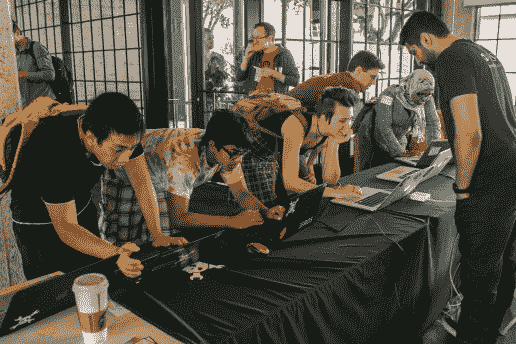
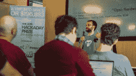
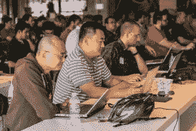
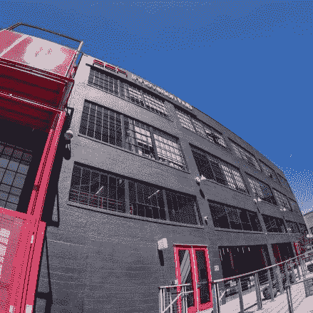
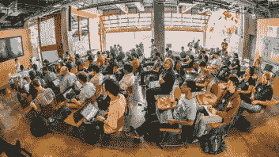
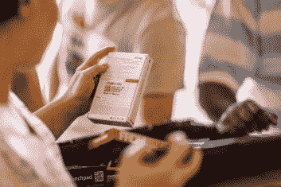
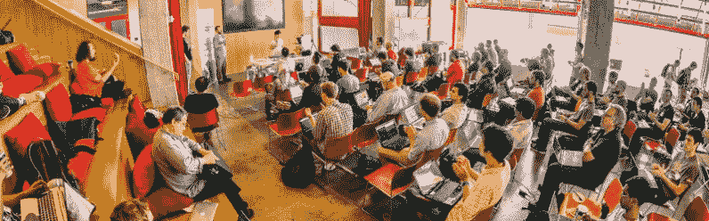
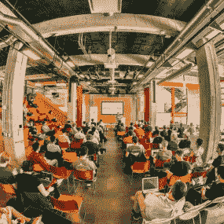
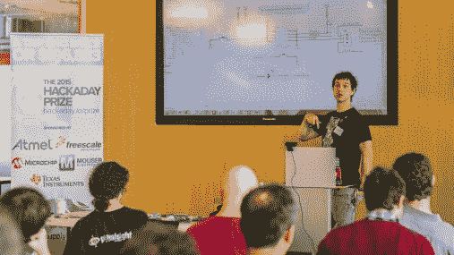

# 世界黑客日奖的完美旧金山

> 原文：<https://hackaday.com/2015/07/06/a-perfect-san-francisco-for-hackaday-prize-worldwide/>

呼，那真是完美的一天。说真的。几周前，6 月 13 日星期六，PCH 国际公司为黑客日*零到产品*研讨会敞开了大门。我不住在加州，所以让两扇巨大的玻璃车库门组成你办公室的一整面墙对我来说很奇怪。但是在这样一个完美的日子里，这简直是奇迹。

  Checking at Hackaday Prize Worldwide-SF  Ryan Vinyard’s talk on Open Hardware  The Workshop Begins

我们在上午 9:30 开始研讨会，那些幸运的人在活动开始前获得了免费门票。手头的主题是专业 PCB 设计知识的转移，而[马特·博格伦]又一次没有让人失望。作为一名前 Altium 资深人士、经验丰富的硬件初创公司 er-er 和全方位的电路设计大师，[Matt]有一种自然和令人满意的方式来处理出现的许多问题，同时也遵循他的史诗般的演讲框架。他的演示文稿中必须有大约 100 张幻灯片，涵盖从元件选择、信号路由、材料选择(基板、铜密度、阻焊材料)等基础知识。

这一天分成几个部分。签到之后是咖啡和烘焙食品，以及来自[Ryan Vinyard]的关于开放硬件的演讲。他是知名硬件创业加速器 Highway1 的工程主管，该加速器为 PCH 创新中心大楼的活动提供了场地。从那里，我们进入了*零到生产*的第一阶段，并开始重复 PCB 设计的所有内容。

  PCH Innovation Hub  Open-air room was amazing  lots of dev boards for those in attendance

三个小时后，吃沙拉和比萨饼的休息时间导致最后两次会议被社交暂停打断。感谢我们的 Hackaday Prize 赞助商(Atmel、Freescale、Microchip、Mouser 和 Texas Instruments ),我们有足够的时间来讨论每个人正在计划的构建，并将他们与赞助商提供的开发板连接起来，以帮助进行原型制作。

      

我们有一个相册，这样你就可以查看这次活动的所有照片。最近几周，我们在[洛杉机](http://hackaday.com/2015/06/02/what-happens-when-we-throw-a-hackathon/)和[深圳](http://hackaday.com/2015/06/29/the-spirit-of-hackaday-shines-in-shenzhen/)举办了*零组件生产*研讨会。继续关注 Hackaday，了解未来参与您所在地区活动的机会！

#### 2015 年[黑客日奖](http://hackaday.io/prize)由以下机构赞助:

