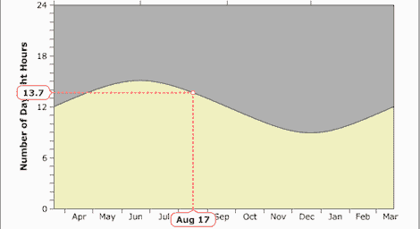

# 一个永久供电的无线前哨站

> 原文：<https://hackaday.com/2012/08/13/a-perpetually-powered-wireless-outpost/>

对[Justin]来说，远程为现场电子设备供电的话题经常出现。事实上，他经常决定推出一个用太阳能和电池为电子设备供电的教程，以及在蜂窝连接的帮助下发送和检索数据。

[Justin]为他的远程无线项目选择的电子设备包括由 Beaglebone 提供的美国电话电报公司 3G 互联网连接、[beagle touch 显示器](http://www.liquidware.com/shop/show/BB-BT/BeagleTouch)和[beagle juice 电池组](http://www.liquidware.com/shop/show/BB-BJC/BeagleJuice)。当然，一个 Arduino 必须进入这个项目，所以一些光传感器被连接到几个 Arduino Unos 并连接到 Beaglebone。

在找到几个深循环船电池后，[贾斯汀]连接了一对太阳能电池板，在阳光充足的情况下可以发出大约 200 毫安的电流。这相当于每天 2700 毫安时，比他的 Beaglebone/Arduino/3G 连接/WiFi 设置每天需要的电量多 300 毫安时。

至于[Justin]可以用他的无线前哨做什么，这使得为农业设置远程传感器变得轻而易举，并且可以很容易地用于自动将游戏摄像头中的图片直接发送到网页上。非常简洁，如果你需要将现场的传感器连接到互联网上，这非常有用。

编辑:是的，[Caleb]抢先发表了这篇文章。他现在在角落里，想着他做了什么。