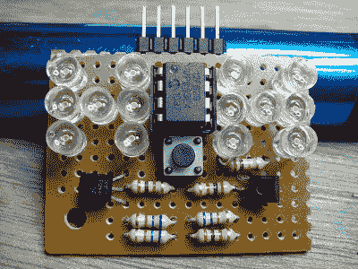

# PIC 供电的一对电子骰子

> 原文：<https://hackaday.com/2012/10/25/a-pic-powered-pair-of-electronic-dice/>

[Timothy]正在通过这个电子骰子项目磨练他的微控制器技能。除了让他有机会处理一些代码之外，8 引脚芯片的使用为驱动 12 个点和提供用户输入提供了设计挑战。

这个项目从价值 4 美元的 LED 圣诞灯开始。他迅速拆开这些线，每条线生产出 100 个发光二极管。他选择使用的微控制器是 PIC 12F629。它的 DIP8 封装提供 6 个 I/O 引脚。当仔细检查时，你会发现骰子上的点总是成对出现，除了中心点。这意味着只需要四个引脚来驱动一个芯片。上面可以看到一对晶体管；一个是 PNP，另一个是 NPN。它们都由同一条 uC 线驱动，在这对芯片之间切换。这占了 5 个可用引脚，第六个监控按钮。