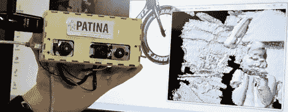

# 一款支持 WiFi 的便携式 Kinect

> 原文：<https://hackaday.com/2012/09/16/a-portable-wifi-enabled-kinect/>

使用 Kinect 作为 3D 扫描仪的建筑越来越好。布里斯托尔大学的一组研究人员通过添加电池、单板 Linux 计算机和 WiFi 适配器，使 Kinect 变得便携。有了他们的移动 Kinect 项目，现在无需携带笔记本电脑，或者只是给你的下一个移动机器人配备一个令人敬畏的视觉系统，就可以轻松地自动绘制环境地图。

通过使 Kinect 变得便携，[Mike]等人使微软的 3D 成像设备比其目前计算橱柜内部体积空间的任务更有能力。 [Reconstructme 项目](http://hackaday.com/2012/03/03/very-easy-3d-scanning-software-with-reconstructme/)允许 Kinect 被用作手持 3D 扫描仪，而[kintinous](http://hackaday.com/2012/06/01/3d-mapping-of-huge-areas-with-a-kinect/)可以被用来创建整个房屋、建筑或洞穴的 3D 模型。

有很多事情可以用一个便携式的 WiFi Kinect 来完成，希望一些复制团队工作的构建(除了用 Raspi 替换 Gumstix 板)将很快出现在 HaD 上。

休息后的视频。

[https://www.youtube.com/embed/sfSqHEtljVg?version=3&rel=1&showsearch=0&showinfo=1&iv_load_policy=1&fs=1&hl=en-US&autohide=2&wmode=transparent](https://www.youtube.com/embed/sfSqHEtljVg?version=3&rel=1&showsearch=0&showinfo=1&iv_load_policy=1&fs=1&hl=en-US&autohide=2&wmode=transparent)