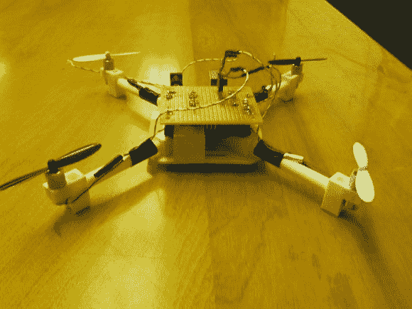

# 从零开始的四轴飞行器

> 原文：<https://hackaday.com/2014/05/12/a-quadcopter-from-scratch/>

[AwesomeAwesomeness]想要一架低成本的四轴飞行器，所以他从头开始建造了一架。好吧，不完全是从零开始。[AA]cookie mix 以 Arduino Uno 和一些马达的形式出现。他从一架 [Hubsan X4 四轴飞行器](http://www.hubsan.com/products/HELICOPTER/H107.htm)的马达和螺旋桨开始。一旦指定了动力系统，[AA]在 Solidworks 中设计了框架、臂和电机舱。他打印出了自己的零件，拥有了一架可爱的四轴飞行器，只需要一个大脑。

[AA]没有购买预制的控制板，而是从 Arduino Uno 开始。单靠 Arduino 无法提供足够的电流来驱动 Hubsan 电机。为了解决这个问题，[AA]增加了一个 ULN2003A 达林顿晶体管阵列。2003A 确实有效，但是[AA]有一些小故障。我们认为 fet 在这种应用中会做得更好，尤其是在运行 PWM 时。

在控制方面，[AA]增加了一个 MPU-6050 三轴加速度计和陀螺仪，来自 [SparkFun](https://www.sparkfun.com/products/11028) 。6050 在一个封装中有 3 个陀螺仪和 3 个加速度计。对四轴飞行器来说足够了。

剩下的就是编码了。多直升机通常使用[比例积分微分(PID)](http://en.wikipedia.org/wiki/PID_controller) 控制回路来保持空中稳定性。[AA]为他的四轴飞行器使用了 [Arduino PID 库](http://playground.arduino.cc/Code/PIDLibrary)。他实际上创建了两个 PID 实例——一个用于俯仰，一个用于滚动。

[AA]还没有他的四轴飞行器的任何视频，我们猜测这部分是由于重量。对于这些发动机来说，提升 Uno、perfboard 和框架是一项艰巨的任务。使用众多微型 Arduino 中的一款将有助于减轻重量。此外，[AA]可以使用类似于在[司马 X 系列](http://www.symatoys.com/product/show/1896.html)四轴飞行器中使用的齿轮系统。坚持下去——你的方向是对的！