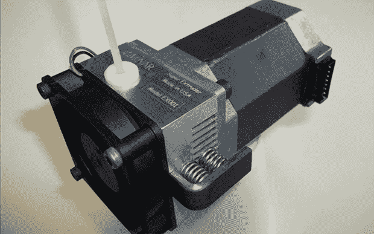

# 一个非常大的挤压器，用来挤压奇异的细丝

> 原文：<https://hackaday.com/2013/12/11/a-really-big-extruder-for-exotic-filaments/>

即使有 ABS、PLA、尼龙、HIPS 和一堆 Taulman 细丝，3D 打印机的世界也错过了大量塑料细丝卷轴的供应。塑料焊条几乎可以从每一个塑料供应商那里买到，品种甚至比库存最多的灯丝网上商店还要多。

这个 Kickstarter 希望把这些奇特的塑料焊条都派上用场。这个家伙不是被设计成只使用 1.75 毫米和 3 毫米的焊丝，而是将直径挤压到 4.76 毫米的焊条。这为由 PDPF、PVC、聚丙烯、聚乙烯和其他高分子量塑料制成的 3D 打印物体打开了大门。

因为这些焊条比通常的塑料丝要大得多，所以这台挤出机还可以选择非常结实的 NEMA 23 发动机。如果你打算自制一台可笑大小的打印机，或者你只是想炫耀你有多棒，这是一个完美的解决方案。