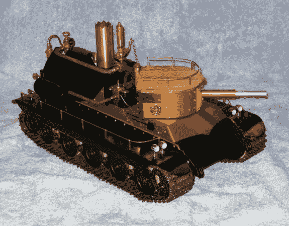

# 一个遥控的、功能齐全的蒸汽动力罐

> 原文：<https://hackaday.com/2014/08/31/a-remote-controlled-fully-functional-steam-powered-tank/>

蒸汽动力如今任何东西都很酷，但我们很少见过像这个蒸汽动力遥控 1/16 比例的水箱这样复杂的建筑。

[Ian]是一名电子设计工程师，他的爱好包括摆弄蒸汽动力。蒸汽炮塔坦克是基于 1/16 比例田宫虎王压铸模型坦克。它的特点是一个来自 macc team 的直径为 3.5″的船用锅炉，这是一个配备齐全的真实锅炉的微型版本，配有压力表、安全阀和陶瓷燃烧器。它可以产生高达 70 磅/平方英寸(最大 120 磅/平方英寸)的压力，但对于这个项目，[伊恩]将其限制在 30 磅/平方英寸左右。

一个直径为 2 英寸的小燃料箱装有丙烷混合物，为锅炉提供燃料。两个 [Regner 40451 Piccolo 蒸汽机](http://www.thetraindepartment.com/regner/steam-engines/)组成了传动系统，由伺服系统控制的机械连杆接合各种功能。坦克可以前进，后退，原地旋转，炮塔既可以旋转，也可以调整弹道。它还有可控制的前灯，甚至可以“开火”炮塔。

他在他的构建日志中加入了惊人数量的细节，以至于你有可能重现这一切——如果你有足够的决心的话。

[https://www.youtube.com/embed/AOuNB8RMtbA?version=3&rel=1&showsearch=0&showinfo=1&iv_load_policy=1&fs=1&hl=en-US&autohide=2&wmode=transparent](https://www.youtube.com/embed/AOuNB8RMtbA?version=3&rel=1&showsearch=0&showinfo=1&iv_load_policy=1&fs=1&hl=en-US&autohide=2&wmode=transparent)

信不信由你，这其实不是我们分享的第一个蒸汽动力坦克，但它可能是最好的。虽然[蒸汽动力六足机器人](http://hackaday.com/2012/09/03/steam-powered-hexapod/)也很酷…