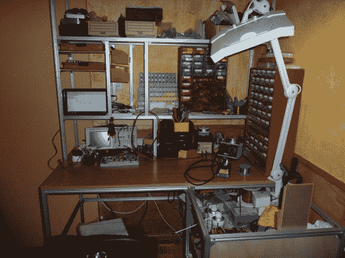

# 一个体面的电子工作台，移动起来一点也不费力

> 原文：<https://hackaday.com/2013/02/26/a-respectable-electronics-bench-thats-not-a-pain-to-move/>

过着游牧生活的公寓居民要注意了。你不需要在工具箱外过着修修补补的生活。这里有一个关于[的很好的例子，一个体面的电子工作台在该移动](http://www.rhaaa.fr/diy-bureau-delectronique-sur-mesure) ( [翻译](http://translate.google.com/translate?hl=en&sl=fr&tl=en&u=www.rhaaa.fr/diy-bureau-delectronique-sur-mesure))的时候坏了。我们确信你已经属于你的大项目的本地黑客空间，但是这个角落办公室将让你把你的一些创作带回家继续调整。

工作台使用开槽的铝轨道作为支撑结构。插槽容纳小螺母，小螺母有一个弹簧加载的滚珠轴承来防止它们自由滑动([Nerick]提到这对于垂直运行的工作特别好)。这些紧固件最终成为最昂贵的部件。桌面本身就是最大的固体块。它是用数控铣床加工的(我们已经提到过 hackerspace 会员资格),所以安装螺丝是埋头孔的，留下一个完美的平面。它很干净，占地面积小，给你一个地方来倾倒你所有的设备。你还能要求什么？