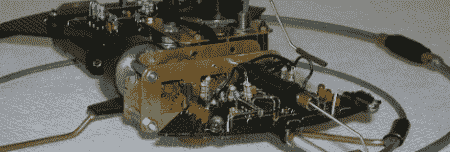

# 一种摇摆和步进梁式机器人

> 原文：<https://hackaday.com/2012/05/18/a-rocking-and-walking-beam-robot/>

在我们这个时代，我们见过一些极简主义机器人，但很少能与[托马斯·林斯马]的[惊人敏捷的光束机器人](http://mechanicalmutants.com/index.php?p=w)相比。看着这个小机器人用它的圆形腿四处爬行绝对令人着迷。

光束机器人是非常简单的机器人，没有任何微控制器。由逻辑芯片和放大器构建极其简单的电路的想法来自于[马克·蒂尔登]在洛斯阿拉莫斯国家实验室研究昆虫机器人时富有成果的头脑。第一个光束机器人——[一个由索尼随身听制成的小型步行器](http://grant.solarbotics.net/walkman.htm)——给许多 90 年代中期的制造者和修补者留下了深刻的印象。尽管人们对这些机器人的兴趣逐渐消失，但网络上仍有一些[社区](http://www.beam-wiki.org/wiki/Main_Page)供梁的建造者们聚在一起展示他们的创造。

大多数光束机器人使用四到六条腿作为移动手段。[托马斯]‘机器人只用两个金属环来走动；一个非常简单的设计，也是我们见过的最流畅的步态。你可以看看[托马斯]休息后四处走动的视频。

向[mefeder]致敬，感谢他送来这封信。

[https://www.youtube.com/embed/UVwxzuKO6B8?version=3&rel=1&showsearch=0&showinfo=1&iv_load_policy=1&fs=1&hl=en-US&autohide=2&wmode=transparent](https://www.youtube.com/embed/UVwxzuKO6B8?version=3&rel=1&showsearch=0&showinfo=1&iv_load_policy=1&fs=1&hl=en-US&autohide=2&wmode=transparent)