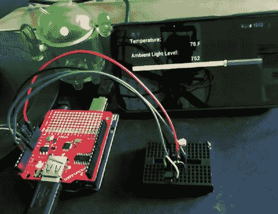

# 一个让你开始使用 Android ADK 的简单项目

> 原文：<https://hackaday.com/2012/04/06/a-simple-project-to-get-you-started-with-the-android-adk/>

如果你刚刚拿到一部闪亮的新 Android 手机，并且正在寻找一个有趣的项目来尝试，你可能想看看[Mike Mitchel]做的这个简单的 Arduino 练习。每个人都需要一个黑客的起点，而[Mike]认为将 Arduino 和 Android 手机结合起来用于温度感应和测光将是一个很好的起点。

这个项目的先决条件不仅仅是一个简单的试验板和几个 IC，还需要一个 80 美元的 Android ADK 板来配合你的手机和 Arduino。然而，如果你的重点是将你的手机与微控制器连接起来，无论如何你都应该尽早购买。

如你所料，设置非常简单。一个光电池和 TMP36 温度传感器连接到 Arduino，然后通过一点代码和 USB 主机魔法，Android 应用程序显示房间内的温度和环境光量。

[Mike]已经将他所有易于阅读且评论良好的代码放到了网上，所以如果你一直在考虑(但推迟了)玩 Android ADK，一定要看看它。