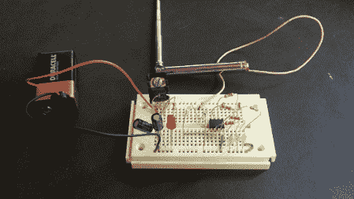

# 一种简单的射频信号强度测量仪

> 原文：<https://hackaday.com/2012/06/12/a-simple-rf-signal-strength-meter/>

[Scott]用他简单但做得很好的[射频信号强度计](http://www.nmscientific.com/picaxe_rf_meter.html "RF signal strength meter")写信给我们。正如他在他的帖子中指出的，有时 Arduino 是多余的，所以用 Picaxe 08M 代替。显然这是他高中项目的更新。当然，我们很多人都想去那所高中！

这个项目的一个有趣的部分是他如何使用激光切割机产生他的 PCB 痕迹。这是通过在他的板子上的铜上涂上黑漆，并在所有他不想要的铜痕迹处进行切割来完成的。结果相当好，并且当这个项目在一个附件中完成时应该工作得很好

休息之后，请观看视频，了解这条电路的运行情况。他解释了它的构建，但如果你只是想看到信号强度灯亮起，快进到 2:25 左右。

[https://www.youtube.com/embed/xxyGhsdG6bk?version=3&rel=1&showsearch=0&showinfo=1&iv_load_policy=1&fs=1&hl=en-US&autohide=2&wmode=transparent](https://www.youtube.com/embed/xxyGhsdG6bk?version=3&rel=1&showsearch=0&showinfo=1&iv_load_policy=1&fs=1&hl=en-US&autohide=2&wmode=transparent)