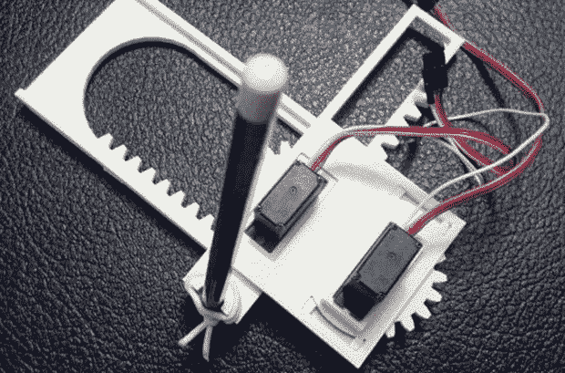

# 六部分组成的数控机床

> 原文：<https://hackaday.com/2013/11/21/a-six-part-cnc-machine/>

数控机床是令人印象深刻的成套设备。我们都喜欢看到高大、魁梧、令人印象深刻的机器，但要看到它们能变得多小，还是有话要说。[Jay]拥有的[可能是我们见过的最小型的数控绘图仪](http://plotterbot.com/2013/11/how-to-build-a-tiny-cnc-drawing-robot/)，仅由六个 3D 打印部件构建而成。

[Jay]的绘图仪是基于 [Piccolo](http://piccolo.cc/) 的，这是一个非常小规模的 CNC 平台，使用激光切割零件只需 70 美元。然而，这个版本只用了六个可以从 Thingiverse 下载的部分[。由一个 Arduino 和两个微型伺服系统驱动，这个数控绘图仪将是任何机器人俱乐部或黑客空间教程系列的数控入门。](http://www.thingiverse.com/thing:187339)

[Jay]一直在用 CNC 绘图仪做一些很棒的工作；本月早些时候我们看到了他的[大画幅绘图仪机器人](http://hackaday.com/2013/11/06/plotterbot-hangs-on-your-wall-to-work/)，他的巨型绘图仪[带有填充海报](http://hackaday.com/2013/11/01/trinket-contest-update-5/)是对我们小饰品比赛的一个很好的提交。

[杰伊]的绘图仪在行动中的视频在休息后可用。

[https://www.youtube.com/embed/1gHFi7L219o?version=3&rel=1&showsearch=0&showinfo=1&iv_load_policy=1&fs=1&hl=en-US&autohide=2&wmode=transparent](https://www.youtube.com/embed/1gHFi7L219o?version=3&rel=1&showsearch=0&showinfo=1&iv_load_policy=1&fs=1&hl=en-US&autohide=2&wmode=transparent)