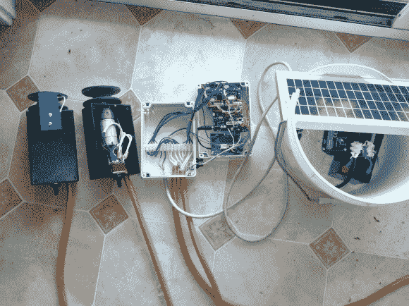

# 一个太阳能驱动的牛过栅栏门

> 原文：<https://hackaday.com/2013/02/28/a-solar-powered-cattle-crossing-gate/>

任何去过养牛场的人都会告诉你，有很多地方需要停下来开关大门。但是这个项目的目的是让你在你的车里舒适的操作这个门。它使用一卷金属线作为闸门，[通过使用遥控器](http://farmsmartsau.blogspot.com.au/2013/02/ben-gate-overview.html)降低闸门，以便车辆进入。

基站使用太阳能电池板来保持电池电量充足。但是如果你不经常使用这个系统，它根本不需要太多的电力。Arduino 板监听来自遥控器的信号。然后，它解开电线，直到它平放在地面上，可以被驱动。一旦汽车通过，再按一下遥控器，门就会升回原位。甚至还有一个版本，用两道门组成了一个养牛走廊。

我们认为牛很容易穿过这里。但看了广告之后的片段后，很明显他们喜欢遵守规则。

[https://www.youtube.com/embed/9NVxla7idNY?version=3&rel=1&showsearch=0&showinfo=1&iv_load_policy=1&fs=1&hl=en-US&autohide=2&wmode=transparent](https://www.youtube.com/embed/9NVxla7idNY?version=3&rel=1&showsearch=0&showinfo=1&iv_load_policy=1&fs=1&hl=en-US&autohide=2&wmode=transparent)

[谢谢马克]