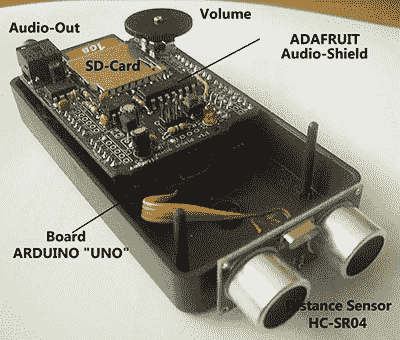

# 一种语音超声波距离传感器

> 原文：<https://hackaday.com/2013/12/03/a-speaking-ultrasonic-distance-sensor/>

[克劳斯]想要某种停车辅助设备，在偶然发现一个价值 4 美元的超声波传感器后，他决定制造自己的[语音距离传感器](http://www.kh-gps.de/distspeak.htm)(。德，[谷歌翻译](http://translate.google.com/translate?sl=de&tl=en&js=n&prev=_t&hl=en&ie=UTF-8&u=http%3A%2F%2Fwww.kh-gps.de%2Fdistspeak.htm&act=url)。

在[克劳斯]的设备内部是一个 Arduino Uno、一个 HC-SR04 超声波距离传感器和一个 [Adafruit 波盾](http://www.adafruit.com/products/94)。最初，这种停车/距离传感器使用一个小 TFT 来显示与物体的距离，但经过几次修改后，[克劳斯]重新设计了该设备，以说出当前的距离，这要归功于 SD 卡和一个舒缓的女声。

现在，声音被设置为以 5 厘米的增量说出从物体到传感器的距离，从 10 厘米到 1 米。不过，这并不是传感器的极限，该设备可以很容易地重新配置，以感应长达 4 米的距离。

该电路板没有放大器或扬声器，但添加了一个小型放大器，【克劳斯】的设备声音足够大，即使在最嘈杂的环境中也能听到。

下面是视频演示。

[https://www.youtube.com/embed/jQzhLnJa9os?version=3&rel=1&showsearch=0&showinfo=1&iv_load_policy=1&fs=1&hl=en-US&autohide=2&wmode=transparent](https://www.youtube.com/embed/jQzhLnJa9os?version=3&rel=1&showsearch=0&showinfo=1&iv_load_policy=1&fs=1&hl=en-US&autohide=2&wmode=transparent)