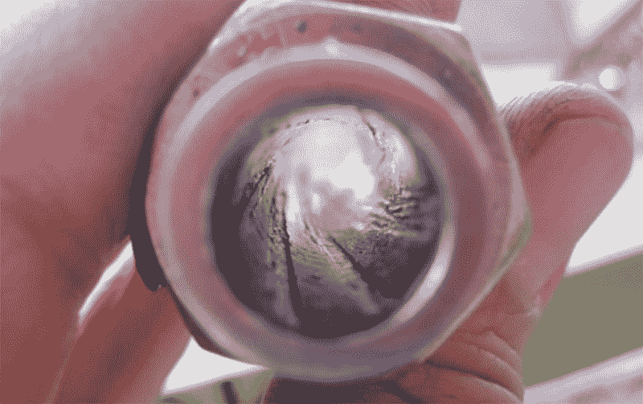

# 钉枪、填缝枪和四管猎枪

> 原文：<https://hackaday.com/2014/11/29/a-staple-gun-caulking-gun-and-four-barrel-shotgun/>

[Clint]的 K-441 是一种填缝枪，能够使用压缩空气从容器中涂抹硅树脂、树脂和液体橡胶。它准确，强大，容量巨大，看起来奇怪的蒸汽朋克，即使对于填缝枪的标准。这可不是普通的填缝枪；这个装置是由钉枪制成的。哦，它还可以在四个膛线枪管的帮助下发射霰弹枪炮弹。

这个发射铅、钢和胶水的装置最初是作为一把普通的钉枪使用的，通常只有 23 磅的拉力。通过添加几块金属板，手工缠绕弹簧，并铣削几个零件，[Clint Westwood]将这种钉枪变成了一种可以发射单个. 410 口径炮弹的设备。就猎枪而言，这是一次练习，但仍然是一次很大的打击。

带着从滚装钉枪中取出猎枪的想法，[Clint]继续建造，增加了几个枪管，每个都装有膛线。[枪管膛线工具本身就是一个黑客](https://www.youtube.com/watch?v=ihPFjuxBjPo)，从一根钢棒开始，缠绕在一根较大的管子上，钉在适当的位置。钻头连接到这个螺旋钻状的装置上，桶安装在夹具上，刀具在桶上慢慢上下移动。这个结果令人印象深刻，因为它可能是用港口货运公司的设备制造的，经过一点清理，[Clint]有四个带膛线的枪管。

在最后的散弹枪形式中，K-441 装有四发 0.410 口径的子弹。枪管索引是手动完成的，但是这个装置*有*有保险，所以我猜它有这个功能。

下面的视频，和我们所有的武器一样，欢迎你在评论中抱怨美国人有多胖和/或多蠢，或者撒旦自己怎么就想不出这么集中邪恶的装置。也欢迎你忽略这些评论。猜猜我们会推荐哪一个？

[https://www.youtube.com/embed/3-6jimx05MU?version=3&rel=1&showsearch=0&showinfo=1&iv_load_policy=1&fs=1&hl=en-US&autohide=2&wmode=transparent](https://www.youtube.com/embed/3-6jimx05MU?version=3&rel=1&showsearch=0&showinfo=1&iv_load_policy=1&fs=1&hl=en-US&autohide=2&wmode=transparent)

[https://www.youtube.com/embed/Y0gYyPpPp6o?version=3&rel=1&showsearch=0&showinfo=1&iv_load_policy=1&fs=1&hl=en-US&autohide=2&wmode=transparent](https://www.youtube.com/embed/Y0gYyPpPp6o?version=3&rel=1&showsearch=0&showinfo=1&iv_load_policy=1&fs=1&hl=en-US&autohide=2&wmode=transparent)

[https://www.youtube.com/embed/ihPFjuxBjPo?version=3&rel=1&showsearch=0&showinfo=1&iv_load_policy=1&fs=1&hl=en-US&autohide=2&wmode=transparent](https://www.youtube.com/embed/ihPFjuxBjPo?version=3&rel=1&showsearch=0&showinfo=1&iv_load_policy=1&fs=1&hl=en-US&autohide=2&wmode=transparent)