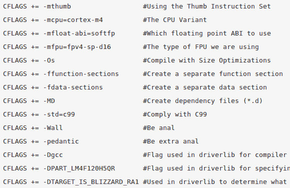

# GCC 与 TI 星状细胞的研究

> 原文：<https://hackaday.com/2012/12/04/a-study-of-gcc-and-the-ti-stellaris/>

TI Stellaris 有几个我们非常喜欢的地方。我们认为外设库——称为 Stellarisware——有一个非常直观的 API，很容易进入。但是让我们印象深刻的是，该软件附带了 makefiless，这些 makefile 使用您自己的 GCC 交叉编译工具链构建库和示例。我们花了相当多的时间翻阅那些 makefiles 和 makedefs 设置文件，以弄清楚 TI 是如何做事情的。现在，如果你不想自己做这种调查，你可以前往刚刚出版的带有 TI Stellaris 发射台指南的 GCC。

上面显示的是有用的编译器标志图表，他从文件中提取了这些标志，并添加了对每个标志的作用的注释。他对链接器标志做了同样的处理，然后讨论了编译和链接过程中的程序调用。然后，他深入研究了如何用代码访问芯片 ROM 上的驱动程序库。这只是他计划写的四部分系列的第一部分。我们迫不及待地想知道他对硬件 FPU 有什么看法，因为我们还没有时间亲自探索。