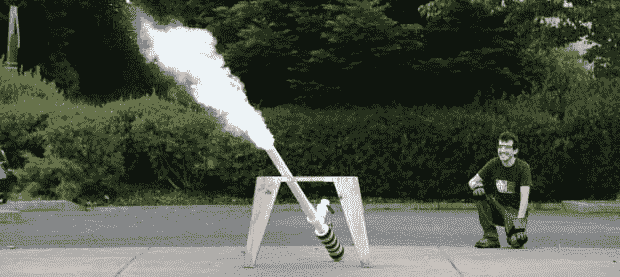

# 壮观的 PVC 大炮

> 原文：<https://hackaday.com/2013/09/15/a-sublime-pvc-cannon/>

不甘落后于发胶驱动的 PVC 加农炮，[威廉]创造了一个更酷的装置:[一个由干冰驱动的加农炮](http://makezine.com/projects/make-35/the-sublimator-dry-ice-cannon/)。

干冰装入压力容器后，将爆破片放入后膛，拧紧枪管。扳机不是很精确——整个枪是由从固体变成气体的干冰提供动力的——但由此产生的云状爆炸远远弥补了任何缺陷。

尽管建造了一个大炮，并使用聚氯乙烯作为压力容器，[比尔]的项目实际上是相当安全的。“触发器”是一个爆破阀，由两片聚氯乙烯之间的铝箔圆盘制成。当压力上升时，铝箔不可避免地撕裂，将桶中的东西射出，希望不会射进眼睛。枪上的“安全装置”是一个直接连接到压力容器的球阀，带有一个压力表和一个释放阀。就 PVC 加农炮而言，我们非常有信心说这是非常安全的。