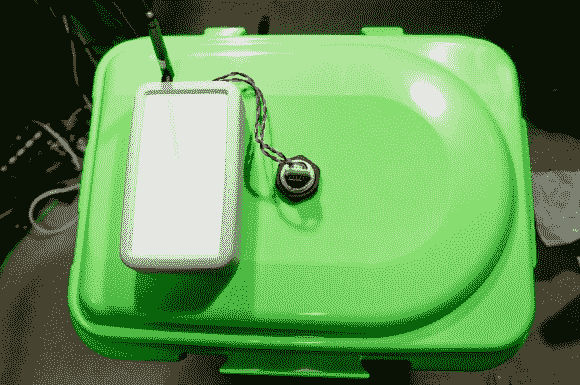

# 监测放射性储水罐的智囊团解决方案

> 原文：<https://hackaday.com/2013/08/31/a-think-tank-solution-for-monitoring-radioactive-water-storge-tanks/>

当我们听到关于放射性水从日本福岛核电站泄漏到海洋中的报道时，我们真的不得不咬牙切齿。当然，这个世界有足够的脑力来克服这些危险。秋叶没有让它折磨他，而是将他的技能指向一个可能有助于解决问题的解决方案。现场有许多储存放射性水的储罐，容易泄漏。听说每天都要人工检查，没有自动液位监控，他开始工作。上图是[他为了测试自己的想法而搭建的无线非接触式储罐液位传感器](http://www.freaklabs.org/index.php/Tutorials/Software/Tutorial-How-to-Fix-Leaky-Radioactive-Water-Tanks.html)装置。

对他来说，几件事让这个项目变得很快。首先，他手头刚好有一个 MaxSonar MB7389 防水声纳传感器。可以把这想象成一个非常棒的 PING 传感器，它是防水的，可以测量高达 5 米的距离。[Akiba 的]假设是，坦克顶部有一个舱口，传感器将被放置在其中。旁边的盒子里有一个他自己设计的 Freakduino，其中包括用于 900 MHz 无线通信的硬件。这就是他用于无线厕所监控器的硬件。

我们真的很喜欢看到黑客对环境问题的解决方案。一个主要的例子是在英国石油公司墨西哥湾漏油事件发生在 T2 的时候，我们看到的一些清理工作。