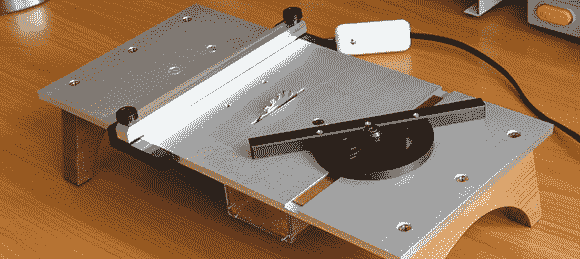

# 定制的小型台锯

> 原文：<https://hackaday.com/2013/03/25/a-tiny-custom-table-saw/>

如果你加工的是小零件，即使是家得宝或洛斯店里最小的台锯通常也是多余的。对于切割小块的木材，金属和覆铜板，微型台锯是一个伟大的投资。它们实际上相当便宜，但是当你能做出比市场上任何型号都好的产品时，为什么只买一个呢？

该床由 1/4”铝板制成，底部用螺栓固定有 1/15 马力的马达。栅栏用一对 delrin 支架夹在桌子上，而角度导轨由 delrin 和黄铜棒制成，黄铜棒安装在桌子的插槽中。

实际的刀片来自 prox on 微型台锯(根据我们的经验，这是一个非常好的品牌)，但将这种自制锯与商业锯进行比较会带来一些惊喜:prox on 有一个更强大的电机，但家酿版本的切割能力是四倍。休息之后，你可以在视频中看到这把锯子正在切割一根 1/4 英寸的铝棒。

谢谢[休伯特]送来这个。

[https://www.youtube.com/embed/NzRSE-ZMdR8?version=3&rel=1&showsearch=0&showinfo=1&iv_load_policy=1&fs=1&hl=en-US&autohide=2&wmode=transparent](https://www.youtube.com/embed/NzRSE-ZMdR8?version=3&rel=1&showsearch=0&showinfo=1&iv_load_policy=1&fs=1&hl=en-US&autohide=2&wmode=transparent)