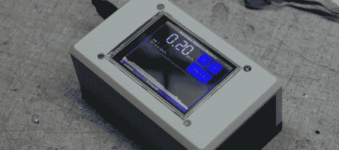

# 没有盖革管的触摸屏盖革计数器

> 原文：<https://hackaday.com/2013/09/14/a-touch-screen-geiger-counter-without-a-geiger-tube/>

我们假设有一天[Toumal]非常无聊，因为他在互联网的深处发现了一些非常酷的组件来建造一个固态盖革计数器。

Arduino 和触摸屏是易贝的标准配置，价格约为 30 美元。真正让这个项目与我们见过的其他盖革计数器不同的是[使用的固态盖革计数器](http://www.radiation-watch.org/p/english.html)【Toumal】。该设备使用由第一传感器制造的[特制光电二极管](http://www.mouser.com/Search/ProductDetail.aspx?qs=XT0h7XtgaRluHeOO0jzfWw%3D%3D)来检测 5 到 1000 keV 的伽马辐射。

[Toumal]在 github 上安装他的 Arduino 触摸屏辐射探测器[的所有软件。老实说，我们真的对这个项目使用的 rad 传感器[Toumal]印象深刻，所以如果你决定选择其中一个，他会为你提供一个 Arduino 库](https://github.com/Toumal/GeigerCounter)。