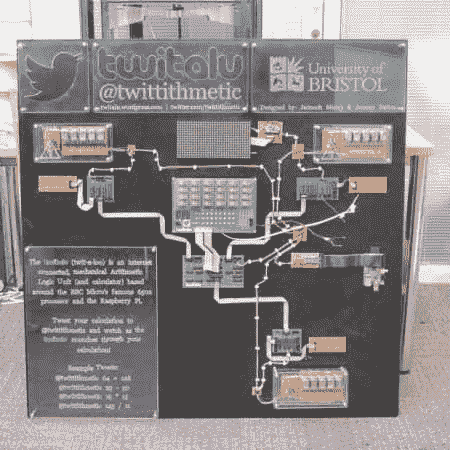

# 一个 Twitter 连接的机械计算器

> 原文：<https://hackaday.com/2013/10/26/a-twitter-connected-mechanical-calculator/>

布里斯托尔大学的两个学生想创造一台计算机来演示算术逻辑单元是如何工作的。结果就是一个与 Twitter 连接的机械计算器 [TwitALU](http://twitalu.wordpress.com/ "TwitALU") 。

该器件使用基于著名的 MOS 6502 处理器的定制 7400 系列 ALU。ALU 驱动机械继电器，而不是在硅片上进行计算。这在计算时会产生一种很好的咔嗒咔嗒的声音。

要开始计算，你可以在推特上发 [@twittithmetic](https://twitter.com/twittithmetic) 来输入数据。Raspberry Pi 用于将指令载入 ALU。一旦计算完成，它就会通过推特反馈给你，并显示在数码管显示屏上。它效率不高，速度也不快，但在做简单的数学运算时，它可以演示设备的内部工作原理。

该器件的原理图都可以在网站上找到，有助于理解一个简单的 ALU 是如何工作的。休息之后，来看看 TwitALU 的一个短片。

[https://www.youtube.com/embed/Ph6hNiPInx8?version=3&rel=1&showsearch=0&showinfo=1&iv_load_policy=1&fs=1&hl=en-US&autohide=2&wmode=transparent](https://www.youtube.com/embed/Ph6hNiPInx8?version=3&rel=1&showsearch=0&showinfo=1&iv_load_policy=1&fs=1&hl=en-US&autohide=2&wmode=transparent)