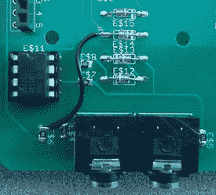

# 一个 WiFi 家用电表

> 原文：<https://hackaday.com/2014/05/16/a-wifi-home-power-meter/>

Christopher MC nally 为他在康奈尔大学的硕士学位设计了[一个简单的、非侵入式的家用电表](http://hackaday.io/project/1150-Power-Monitor)，它能做“智能电表”能做的一切——记录整个家庭的电力消耗，并通过 WiFi 显示家庭的电力消耗日志。他甚至在测试一些有趣的想法，比如通过读取当前数据来自动检测特定设备何时开启。

来自[Chris]'[Jeramy]围绕 Arduino 和以太网屏蔽开发了他的系统，负责联网和选择微处理器，让他有更多时间开发项目中更有趣的部分:感测电流。为此，他使用了一个小型的夹式电流传感器。这种传感器在一个电阻上产生高达 10 伏的交流电，但 Arduino 不适合交流电，需要一个围绕运算放大器构建的小型整流器。

虽然该项目是一个自制的智能电表，但[Jeramy]无法自动检测某些设备何时开机。这部分是由于电流的变化只能在幅度上看到，而不能在波形上看到。此外，如果两个器件同时通电，软件会将它视为一个较大的器件，吸取两个较小器件的电流之和。尽管如此，[Jeramy]还是想出了一种廉价的方法来测量任何家庭的电力，他的解决方案的成本比许多专业系统都要便宜。

所有的代码、文件和设计报告都可以在[Jeramy]的 git 上获得。