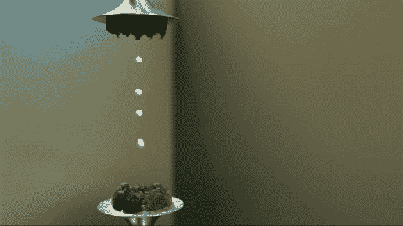

# 水滴的声悬浮

> 原文：<https://hackaday.com/2012/12/06/acoustic-levitation-of-water-droplets/>

这些水滴没有落下；它们实际上卡在了原地。我们看到的是[声波悬浮器](http://www.anl.gov/articles/no-magic-show-real-world-levitation-inspire-better-pharmaceuticals)的效果。该设备最初由美国宇航局开发，用于模拟微重力。现在它被制药工业用来开发更好的药物。

上图中看到的设备的两个部分都是扬声器。它们发出大约 22 千赫的声音，这超出了人类的听觉范围。当精确排列时，它们相互干涉并产生驻波。水滴被收集在波的节点中。

那么这些人只是在摆弄那些花哨的实验室设备吗？没有。悬浮被用来蒸发药物中的水分，而不会接触到容器的侧面。这防止了溶液中晶体的形成。但是我们喜欢它的新奇，希望看到有人在他们的家庭工作室里把它们组装起来。

休息后不要错过剪辑中的神秘演示。

[https://www.youtube.com/embed/669AcEBpdsY?version=3&rel=1&showsearch=0&showinfo=1&iv_load_policy=1&fs=1&hl=en-US&autohide=2&wmode=transparent](https://www.youtube.com/embed/669AcEBpdsY?version=3&rel=1&showsearch=0&showinfo=1&iv_load_policy=1&fs=1&hl=en-US&autohide=2&wmode=transparent)