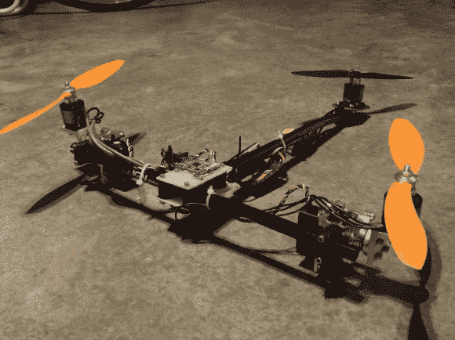

# 杂技三翼飞机灵感来自遗忘电影预告片

> 原文：<https://hackaday.com/2013/04/24/acrobatic-tricopter-inspired-by-the-oblivion-movie-trailer/>

汤姆·克鲁斯的新片《湮没》已经有了大量的商业广告。我们记得看到的每个片段中的一个要点是*壮志凌云*遇上*星际迷航*飞船，他在里面表演了一些特技。[詹姆斯·科顿]喜欢那个片段，并最终[建造了他自己的 RC 版汽车](http://buildandcrash.blogspot.com/2013/04/triblivion-and-sparky.html)。

三个螺旋桨为它提供升力，伺服电机推动方向控制，伺服电机可以转动连接到两个橙色螺旋桨的电机。这种设计产生了非常灵敏的控制，如休息后的视频所示。也就是说，它仍然不能避免操作员的失误。在剪辑的结尾[詹姆斯]狠狠地撞了一下，剥掉了伺服电机上的齿轮。

他对该设备的未来有一些想法(在等待替代伺服系统到来的同时，他将有足够的时间进行规划)。这架飞机应该能够随身携带一架照相机。他讨论了基于倾斜马达的动作摄像机最终指向哪里的问题。但我们认为他可以建造一个底座，让相机独立于底盘进行平移和倾斜。

你可以在这附近找到一些三翼飞机项目，但我们一直喜欢用纸板做的那个。

[https://player.vimeo.com/video/64357725](https://player.vimeo.com/video/64357725)