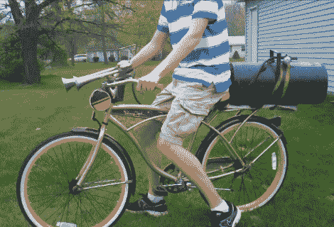

# 给你的耳机增加一个火车喇叭(不包括耳塞)

> 原文：<https://hackaday.com/2012/04/13/add-a-train-horn-to-your-hoopty-earplugs-not-included/>

[领班]好心地解释说，他装在自行车上的空气喇叭实际上没有火车喇叭响。这种声音只能在半英里外听到。但是我们确信你耳朵里的铃声看起来是一样的…休息后的视频证明这东西实在是太大声了。

你不需要太多，只需要一对空气喇叭和一个压缩空气源。[查德]有一个十加仑的空气罐绑在后面的行李架上。我们敢打赌，在耗尽水库之前，他还能坚持一段时间。最难的部分是(除了在不倾家荡产的情况下采购零件之外)把所有东西都装到自行车上。这就是为什么他建议使用巡洋舰自行车，因为他们往往已经在后面有一个机架。对于喇叭支架[乍得]发现一个皮革杯架几乎完美的工作。

我们认为他需要扭转这种局面，并添加一些压缩的可燃物来增加火焰的燃烧和噪音。

[https://www.youtube.com/embed/eEqqvoSD2P0?version=3&rel=1&showsearch=0&showinfo=1&iv_load_policy=1&fs=1&hl=en-US&autohide=2&wmode=transparent](https://www.youtube.com/embed/eEqqvoSD2P0?version=3&rel=1&showsearch=0&showinfo=1&iv_load_policy=1&fs=1&hl=en-US&autohide=2&wmode=transparent)

[通过 [Gizmodo](http://gizmodo.com/5901589/announce-your-dominion-over-the-bike-lane-with-the-blast-of-a-freight-train)