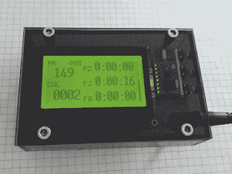

# 为您的健身设备添加心率监测器

> 原文：<https://hackaday.com/2012/07/12/adding-a-heart-rate-monitor-to-your-exercise-equipment/>

这是[Remick]加在他固定自行车上的读数。它显示心率、消耗的卡路里和一些其他项目来帮助激励他的日常锻炼。

当他订购 TI Chronos 手表时，他还挑选了心率胸带和接收器。可以使用 UART 读取接收器，从而方便与驱动系统的 ATmega328 接口。屏幕是一个图形液晶显示器，这使他能够很好地控制如何组织显示的数据。侧面的三个按钮操作菜单系统，用户可以输入性别、年龄和体重信息。这用于计算消耗的卡路里和最大心率的百分比。右侧的三个读数是在每个锻炼区域(脂肪燃烧、健身或运动)花费的时间。最终产品看起来很棒，因为他蚀刻的 PCB 和他装它的盒子。