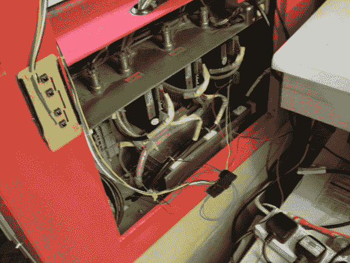

# 为激光添加手动 Z 轴

> 原文：<https://hackaday.com/2014/03/10/adding-a-manual-z-axis-to-your-laser/>

[马丁·兰斯福德]卖激光，激光切割东西为生——我们有点嫉妒。不管怎么说，来自中国的激光切割机很棒，但有时缺乏某些功能，所以他决定添加他自己的[z 轴功能！](http://msraynsford.blogspot.co.uk/2014/03/z-axis-controller-replacement.html)

他使用的主要激光切割机具有非常慢的 z 轴，并且也很难控制——不能暂停作业来调整高度偏移，每次都必须手动设置基准，并且您必须在菜单的最顶层才能使用它做任何事情！考虑到这一点，[马丁]决定增加自己的 z 轴控制，完全独立于激光器的机载控制系统。

他使用 Arduino Pro Mini 通过 PWM 控制步进电机。他的新控制器有四个按钮——快速和慢速，每个方向都有。他使用原来的终点挡板来保护轴，他还增加了一个功能，通过同时按住快速和慢速按钮来设置基准。这最终成为他的系统的一个非常便宜的升级，他也为任何想要重新创建它的人分享了源代码。

[https://www.youtube.com/embed/mry7fHPdSSo?version=3&rel=1&showsearch=0&showinfo=1&iv_load_policy=1&fs=1&hl=en-US&autohide=2&wmode=transparent](https://www.youtube.com/embed/mry7fHPdSSo?version=3&rel=1&showsearch=0&showinfo=1&iv_load_policy=1&fs=1&hl=en-US&autohide=2&wmode=transparent)

对于其他有用的激光切割工具，别忘了看看这个超级便宜的制作自己的激光反射镜的方法！或者用散热器做成的廉价蜂巢床[怎么样？](http://hackaday.com/2014/02/22/a-cheap-honeycomb-table-replacement-for-your-laser/)