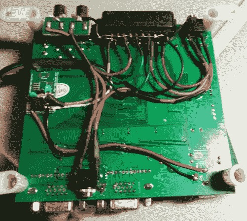

# 向控制台 VGA 转换器添加 SCART 输入

> 原文：<https://hackaday.com/2012/11/22/adding-a-scart-input-to-a-console-vga-converter/>

如果您正在使用 CGA、EGA 或 RGB 游戏系统，这种廉价的主板可以很好地将信号转换为 VGA，以便您可以使用现代显示器进行游戏。但是如果您有一个 SCART 连接器作为输出呢？这就是[EverestX]发现自己如此[的情况，他黑进了 SCART support](https://www.soldierx.com/bbs/201211/CGAEGA-VGA-converter-Upgrayedd)。

第一步是寻找一个母 SCART 连接器。他从易贝身上抓起一个连接器，把它砸开，产生了两个连接器。现在开始布线，你可能已经注意到，这里有很多东西，不仅仅是颜色通道、同步信号和地。从技术上来说，这是你实现这一切所需要的，但是结果不会很好。首先，SCART 的同步信号往往相当糟糕。这就是蓝色分线板发挥作用的地方。[EverestX]使用 LM1881 抓取复合同步(是的，复合同步，而不是分量同步)信号，作为 VGA 转换器的馈入。他还增加了一个音频插孔，用于通过连接器传输声音。